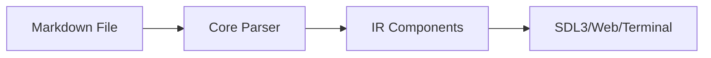

# Kryon UI Framework

A declarative UI framework with multiple frontends (.kry, .nim, .md) and rendering backends (SDL3, terminal, web).

## Quick Start

### Using `.kry` files (recommended for simple UIs)

```kry
// hello.kry
App {
    windowTitle = "Hello Kryon"
    windowWidth = 800
    windowHeight = 600

    Container {
        width = 200
        height = 100
        backgroundColor = "#191970"
        contentAlignment = "center"

        Text {
            text = "Hello World"
            color = "yellow"
        }
    }
}
```

Run with: `kryon run hello.kry`

### Using Nim DSL (for reactive apps)

```nim
import kryon_dsl

let app = kryonApp:
  Header:
    windowWidth = 800
    windowHeight = 600
    windowTitle = "Hello Kryon"

  Body:
    backgroundColor = "#2C3E50"

    Center:
      Column:
        gap = 20

        Text:
          text = "Hello Kryon!"
          fontSize = 32
          color = "#ECF0F1"

        Button:
          text = "Click Me"
          onClick = proc() =
            echo "Button clicked!"

app.run()
```

Run with: `kryon run hello.nim`

### Using Markdown (for documentation and content)

```markdown
# My App Documentation

Welcome to **Kryon**! This entire UI is written in *markdown*.

## Features

- ✅ Full CommonMark support
- ✅ Tables, lists, code blocks
- ✅ Native Mermaid flowcharts

## Architecture



Run with interactive flowcharts!
```

Run with: `kryon run docs.md`

## Installation

### Using Nix (Recommended)

```bash
cd kryon
nix-shell
make build
make install   # Installs kryon CLI to ~/.local/bin
```

### Manual Installation

```bash
# Install Nim (>= 2.0)
curl https://nim-lang.org/choosenim/init.sh -sSf | sh

# Build C libraries and CLI
make build
make install
```

The `make install` command installs:
- `kryon` CLI to `~/.local/bin/`
- Shared libraries to `~/.local/lib/`

## Usage

### CLI Commands

```bash
# Run applications
kryon run examples/kry/hello_world.kry   # Run .kry file
kryon run examples/nim/button_demo.nim   # Run Nim app
kryon run examples/md/documentation.md   # Run markdown file
kryon run app.kir                        # Run pre-compiled IR

# Parse to .kir (JSON IR)
kryon parse hello.kry                    # .kry to .kir
kryon parse docs.md                      # .md to .kir
kryon parse-html build/app.html          # HTML to .kir (roundtrip)

# Inspect IR files
kryon tree app.kir                       # Show component tree
kryon inspect-detailed app.kir           # Full analysis

# Development mode with hot reload
kryon dev examples/nim/habits.nim
```

### Run Examples Script

```bash
./run_example.sh hello_world             # Auto-generates .nim, runs with SDL3
./run_example.sh button_demo nim         # Test round-trip transpilation
KRYON_RENDERER=terminal ./run_example.sh hello_world  # Use terminal renderer
```

**Note:** The script automatically generates `.nim` files from `.kry` sources if they don't exist.

### Available Backends

- **SDL3** - Modern cross-platform, hardware accelerated (default)
- **Terminal** - Text-based UI using ANSI escape sequences

```bash
# Set renderer via environment variable
KRYON_RENDERER=terminal kryon run app.kry
```

## Features

- ✅ Multiple frontends (.kry, .nim, .md)
- ✅ Declarative DSL syntax
- ✅ Multiple rendering backends (SDL3, terminal, web)
- ✅ HTML transpilation with roundtrip validation
- ✅ Full CommonMark markdown support
- ✅ Native Mermaid flowchart integration
- ✅ Event handlers (onClick, onChange, onSubmit, etc.)
- ✅ Reactive state management
- ✅ Flexible layout system (Column, Row, Center, Grid)
- ✅ Rich components (Button, Input, Checkbox, Dropdown, Tabs)
- ✅ Styling (colors, borders, padding, fonts)
- ✅ Text rendering with custom fonts
- ✅ Mouse and keyboard input

## Components

- **Container** - Generic container with styling
- **Text** - Text display
- **Button** - Clickable button with hover states
- **Input** - Text input field with focus and cursor
- **Checkbox** - Toggle checkbox with label
- **Dropdown** - Selection dropdown with keyboard navigation
- **Column** - Vertical layout with alignment options
- **Row** - Horizontal layout with alignment options
- **Center** - Centered layout
- **TabGroup/TabBar/Tab/TabContent** - Tab-based navigation
- **Grid** - Grid layout (planned)

## Documentation

Full documentation is available at the [Kryon Website](https://kryon-website.netlify.app/docs) (or run locally with `cd kryon-website && kryon build --targets=web`).

**Quick Links:**
- [Architecture](https://kryon-website.netlify.app/docs/architecture) - System design and IR pipeline
- [Language Bindings](https://kryon-website.netlify.app/docs/nim-bindings) - Nim, Rust, TypeScript, JavaScript, Lua, C
- [Developer Guide](https://kryon-website.netlify.app/docs/developer-guide) - Building and contributing

## Examples

Examples are auto-generated from `.kry` sources. Only `.kry` files are checked into git.

### Generate Examples

```bash
make generate-examples      # Generate all .nim examples from .kry
make validate-examples      # Validate round-trip transpilation (must be 100%)
```

### Available Examples (in `examples/kry/`)

All 14 examples are source-controlled as `.kry` files:
- `hello_world.kry` - Basic hello world
- `button_demo.kry` - Button interactions and states
- `counters_demo.kry` - Reactive state management
- `animations_demo.kry` - Smooth animations and transitions
- `tabs_reorderable.kry` - Drag-to-reorder tabs
- `checkbox.kry` - Checkbox component
- `text_input_simple.kry` - Text input with reactive display
- `todo.kry` - Todo list application
- `navigation_simple.kry` - Navigation between screens
- `bidi_demo.kry` - BiDi text (Hebrew, Arabic)
- `typography_showcase.kry` - Font features and text styling
- `canvas_basics.kry` - Basic canvas rendering
- `canvas_shapes.kry` - Shape rendering
- `zindex_test.kry` - Z-index layering

**DO NOT edit** generated `.nim` files - they will be overwritten!
**DO edit** `.kry` source files in `examples/kry/`.

### Markdown Examples (in `examples/md/`)

8 markdown examples demonstrating all features:
- `hello_world.md` - Simple markdown introduction
- `inline_formatting.md` - Bold, italic, links, code
- `lists.md` - Ordered, unordered, and nested lists
- `table_demo.md` - Tables with alignment
- `code_blocks.md` - Syntax highlighting for multiple languages
- `flowchart.md` - Native Mermaid flowchart integration
- `documentation.md` - Full-featured documentation page
- `README.md` - Overview of markdown support

Run with: `kryon run examples/md/<filename>.md`

## License

BSD-Zero-Clause
