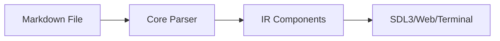

# Kryon UI Framework

A declarative UI framework with multiple frontends (.kry, .nim, .tsx, .md) and rendering backends (SDL3, terminal). Includes HTML/web transpilation for browser deployment.

## Quick Start

### Using `.kry` files (recommended for simple UIs)

```kry
// hello.kry
App {
    windowTitle = "Hello Kryon"
    windowWidth = 800
    windowHeight = 600

    Container {
        width = 200
        height = 100
        backgroundColor = "#191970"
        contentAlignment = "center"

        Text {
            text = "Hello World"
            color = "yellow"
        }
    }
}
```

Run with: `kryon run hello.kry --renderer=sdl3`

### Using Nim DSL (for reactive apps)

```nim
import kryon_dsl

let app = kryonApp:
  Header:
    windowWidth = 800
    windowHeight = 600
    windowTitle = "Hello Kryon"

  Body:
    backgroundColor = "#2C3E50"

    Center:
      Column:
        gap = 20

        Text:
          text = "Hello Kryon!"
          fontSize = 32
          color = "#ECF0F1"

        Button:
          text = "Click Me"
          onClick = proc() =
            echo "Button clicked!"

app.run()
```

Run with: `kryon run hello.nim`

### Using Markdown (for documentation and content)

```markdown
# My App Documentation

Welcome to **Kryon**! This entire UI is written in *markdown*.

## Features

- ✅ Full CommonMark support
- ✅ Tables, lists, code blocks
- ✅ Native Mermaid flowcharts

## Architecture



Run with interactive flowcharts!
```

Run with: `kryon run docs.md`

## Installation

### Using Nix (Recommended)

```bash
cd kryon
nix-shell
make build
make install   # Installs kryon CLI to ~/.local/bin
```

### Manual Installation

```bash
# Install Nim (>= 2.0)
curl https://nim-lang.org/choosenim/init.sh -sSf | sh

# Build C libraries and CLI
make build
make install
```

The `make install` command installs:
- `kryon` CLI to `~/.local/bin/`
- Shared libraries to `~/.local/lib/`

## Usage

### CLI Commands

```bash
# Run applications
kryon run <file> [options]               # Run .kry, .nim, .md, or .kir files
kryon run app.kry --renderer=sdl3        # Use specific renderer
kryon run app.kry --target=web           # Deploy to web with dev server
kryon run app.kry --watch                # Enable hot reload

# Compile to KIR (JSON IR)
kryon compile <source> [output.kir]      # Source to .kir
kryon compile app.tsx --watch            # With hot reload

# Generate code from KIR
kryon codegen <target> [input.kir]       # Generate source code
kryon codegen tsx app.kir app.tsx        # TSX generation
kryon codegen lua app.kir --output=lua/  # Lua generation

# Development
kryon dev [entry]                        # Dev server with hot reload
kryon build [--target=<platform>]        # Build entire project

# Inspect and debug
kryon inspect [--tree] [--full] app.kir  # Show component tree
kryon diff app1.kir app2.kir             # Compare KIR files
kryon config [show|validate]             # Show/validate kryon.toml

# Project management
kryon new <project-name>                 # Create new project
kryon install [--mode=symlink]           # Install to system
kryon uninstall [--all]                  # Uninstall from system

# Plugins
kryon plugin list                        # List installed plugins
kryon plugin info <name>                 # Show plugin details
```

### Available Targets

| Target | Description |
|--------|-------------|
| `desktop` | Native desktop applications (default) |
| `web` | HTML/CSS/JS for browsers with dev server |
| `android` | Android APK generation and deployment |
| `terminal` | Text-based UI using ANSI escape codes |
| `embedded` | Embedded systems targets |

### Run Examples Script

```bash
./run_example.sh hello_world             # Auto-generates .nim, runs with SDL3
./run_example.sh button_demo nim         # Test round-trip transpilation
KRYON_RENDERER=terminal ./run_example.sh hello_world  # Use terminal renderer
```

**Note:** The script automatically generates `.nim` files from `.kry` sources if they don't exist.

### Available Rendering Backends

- **SDL3** - Modern cross-platform, hardware accelerated (default)
- **Raylib** - Alternative rendering backend
- **Terminal** - Text-based UI using ANSI escape sequences

```bash
# Runtime renderer selection (recommended)
kryon run app.kry --renderer=sdl3
kryon run app.kry --renderer=raylib

# Or set via environment variable
KRYON_RENDERER=raylib kryon run app.kry
```

**Renderer priority:** `--renderer` flag > `kryon.toml` config > environment variable > default (sdl3)

## Features

- ✅ Multiple frontends (.kry, .nim, .tsx, .lua, .md, .html)
- ✅ Declarative DSL syntax
- ✅ Rendering backends (SDL3, Raylib, Terminal)
- ✅ Multiple target platforms (desktop, web, android, terminal, embedded)
- ✅ HTML/web transpilation with dev server
- ✅ Full CommonMark markdown support
- ✅ Native Mermaid flowchart integration
- ✅ Event handlers (onClick, onChange, onSubmit, etc.)
- ✅ Reactive state management
- ✅ Flexible layout system (Column, Row, Center, Grid)
- ✅ Rich components (Button, Input, Checkbox, Dropdown, Tabs)
- ✅ Styling (colors, borders, padding, fonts)
- ✅ Text rendering with custom fonts
- ✅ Mouse and keyboard input
- ✅ Hot reload with --watch flag
- ✅ Runtime renderer selection

## Components

- **Container** - Generic container with styling
- **Text** - Text display
- **Button** - Clickable button with hover states
- **Input** - Text input field with focus and cursor
- **Checkbox** - Toggle checkbox with label
- **Dropdown** - Selection dropdown with keyboard navigation
- **Column** - Vertical layout with alignment options
- **Row** - Horizontal layout with alignment options
- **Center** - Centered layout
- **TabGroup/TabBar/Tab/TabContent** - Tab-based navigation
- **Grid** - Grid layout (planned)

## Code Generation

Kryon can generate source code from KIR files for multiple target languages:

| Target | Status | Description |
|--------|--------|-------------|
| `kry` | ✅ Production | Round-trip Kryon DSL |
| `tsx` | ✅ Production | TypeScript React with hooks |
| `nim` | ✅ Production | Nim DSL with reactive state |
| `lua` | ✅ Production | Lua DSL (multi-file) |
| `html` | ✅ Production | HTML/CSS/JS for web browsers |
| `kotlin` | ✅ Production | Android MainActivity |
| `markdown` | ✅ Production | Markdown documentation |
| `c` | 🚧 Partial | C source code with Kryon API |
| `jsx` | 🚧 Stubs | JavaScript React |

```bash
# Generate code from KIR
kryon codegen tsx app.kir app.tsx
kryon codegen lua app.kir --output=lua/
kryon codegen kotlin app.kir MainActivity.kt
```

## Configuration

Project configuration is managed through `kryon.toml`:

```toml
[project]
name = "My App"
version = "0.1.0"
author = "Your Name"
description = "A Kryon application"

[build]
target = "desktop"
frontend = "lua"
entry = "main.lua"
output_dir = "dist"

# Desktop renderer (sdl3 or raylib)
desktop_renderer = "sdl3"

[dev]
hot_reload = true
port = 3000          # Dev server port
auto_open = true     # Auto-open browser

[optimization]
enabled = true
minify_css = true
minify_js = true
```

## Testing

Kryon includes `kryon-test`, a visual regression testing framework for automated screenshot-based testing.

### Installation

```bash
cd kryon-test
make
```

### Usage

```bash
# Run tests
./build/kryon-test run configs/habits.yaml
./build/kryon-test run configs/habits.yaml sdl3    # Test specific renderer

# Generate baseline screenshots
./build/kryon-test baseline configs/habits.yaml
./build/kryon-test baseline configs/habits.yaml raylib

# Validate configuration
./build/kryon-test validate configs/habits.yaml

# List all test configurations
./build/kryon-test list
```

### Configuration Format

```yaml
app_name: "Habits Tracker"

app:
  path: "/absolute/path/to/app"
  entry: "main.lua"
  frontend: "lua"
  screenshot_delay_ms: 500
  window:
    width: 800
    height: 600

renderers:
  - sdl3
  - raylib

failure_threshold: 0.05  # 5% pixel difference allowed
```

## Environment Variables

### Rendering

| Variable | Description |
|----------|-------------|
| `KRYON_RENDERER=sdl3\|raylib\|terminal` | Default renderer |
| `KRYON_ENABLE_RAYLIB=1` | Enable Raylib renderer |
| `KRYON_ENABLE_ESCAPE_QUIT=1` | Allow ESC to quit |

### Debug & Tracing

| Variable | Description |
|----------|-------------|
| `KRYON_TRACE_COMMANDS=1` | Trace rendering commands |
| `KRYON_TRACE_LAYOUT=1` | Trace layout calculations |
| `KRYON_TRACE_POLYGON=1` | Trace polygon rendering |
| `KRYON_DEBUG_RENDERER=1` | Enable renderer debugging |
| `KRYON_DEBUG_LAYOUT=1` | Debug layout system |
| `KRYON_WIREFRAME=1` | Enable wireframe mode |
| `KRYON_WIREFRAME_SHOW_FOR_EACH=1` | Show ForEach boundaries |
| `KRYON_WIREFRAME_SHOW_REACTIVE=1` | Show reactive components |

### Screenshot & Headless

| Variable | Description |
|----------|-------------|
| `KRYON_SCREENSHOT=/path/file.png` | Capture screenshot after launch |
| `KRYON_SCREENSHOT_AFTER_FRAMES=N` | Capture after N frames (default: 5) |
| `KRYON_HEADLESS=1` | Exit after screenshot (CI mode) |

### Development

| Variable | Description |
|----------|-------------|
| `KRYON_DEV_MODE=1` | Enable development mode |
| `KRYON_WS_PORT=3001` | WebSocket port for hot reload |
| `KRYON_HOT_RELOAD=1` | Enable hot reload mode |
| `KRYON_CACHE_DIR=/path/to/cache` | Override cache directory |

## Documentation

Full documentation is available at the [Kryon Website](https://kryon-website.netlify.app/docs) (or run locally with `cd kryon-website && kryon build --targets=web`).

**Quick Links:**
- [Architecture](https://kryon-website.netlify.app/docs/architecture) - System design and IR pipeline
- [Language Bindings](https://kryon-website.netlify.app/docs/nim-bindings) - Nim, Rust, TypeScript, JavaScript, Lua, C
- [Developer Guide](https://kryon-website.netlify.app/docs/developer-guide) - Building and contributing

## Examples

Examples are auto-generated from `.kry` sources. Only `.kry` files are checked into git.

### Generate Examples

```bash
make generate-examples      # Generate all .nim examples from .kry
make validate-examples      # Validate round-trip transpilation (must be 100%)
```

### Available Examples (in `examples/kry/`)

All 14 examples are source-controlled as `.kry` files:
- `hello_world.kry` - Basic hello world
- `button_demo.kry` - Button interactions and states
- `counters_demo.kry` - Reactive state management
- `animations_demo.kry` - Smooth animations and transitions
- `tabs_reorderable.kry` - Drag-to-reorder tabs
- `checkbox.kry` - Checkbox component
- `text_input_simple.kry` - Text input with reactive display
- `todo.kry` - Todo list application
- `navigation_simple.kry` - Navigation between screens
- `bidi_demo.kry` - BiDi text (Hebrew, Arabic)
- `typography_showcase.kry` - Font features and text styling
- `canvas_basics.kry` - Basic canvas rendering
- `canvas_shapes.kry` - Shape rendering
- `zindex_test.kry` - Z-index layering

**DO NOT edit** generated `.nim` files - they will be overwritten!
**DO edit** `.kry` source files in `examples/kry/`.

### Markdown Examples (in `examples/md/`)

8 markdown examples demonstrating all features:
- `hello_world.md` - Simple markdown introduction
- `inline_formatting.md` - Bold, italic, links, code
- `lists.md` - Ordered, unordered, and nested lists
- `table_demo.md` - Tables with alignment
- `code_blocks.md` - Syntax highlighting for multiple languages
- `flowchart.md` - Native Mermaid flowchart integration
- `documentation.md` - Full-featured documentation page
- `README.md` - Overview of markdown support

Run with: `kryon run examples/md/<filename>.md`

## License

BSD-Zero-Clause
