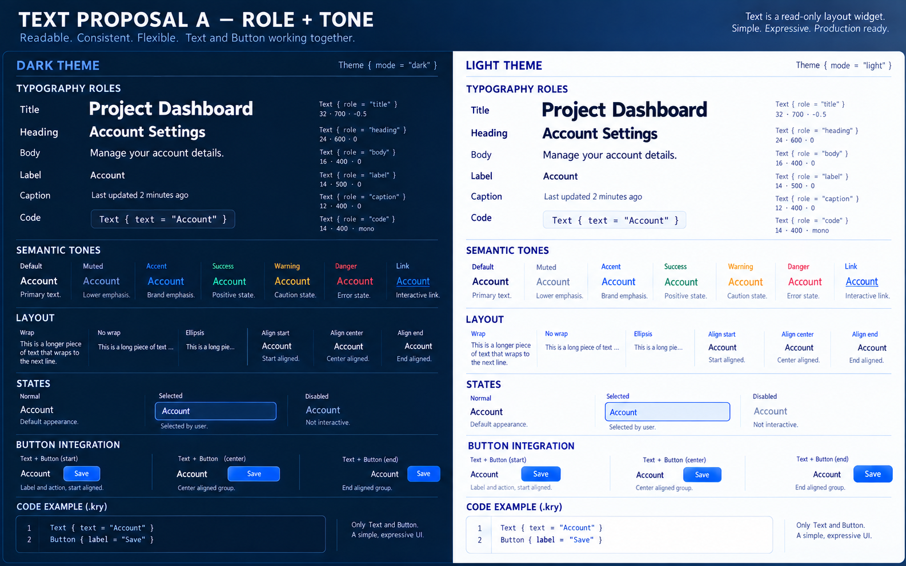

# Kryon Text and Button Content Specification

Status: selected design  
Scope: canonical `.kry` Text node, typography, and Button content composition  
Rule: one implementation, one theme, no public `UI` prefixes, no legacy aliases



## 1. Decision

Kryon has one read-only text node:

```kry
Text title: {
    text = "Account"
    role = Title
}
```

`Text` is a normal layout node. It measures, wraps, aligns, truncates, selects,
and paints UTF-8 text from the active `Theme`. Editable content remains
`TextField` or `TextArea`.

There is no `UIText`, `UITextNode`, `WidgetText`, positional Text overload, or
public `DrawUIText*` alternative.

## 2. Button uses Text directly

Button is a content container. It never measures or paints label text itself.
The concise label property creates one ordinary child `Text` node:

```kry
Button save: {
    label = "Save"
}
```

This is exactly equivalent to:

```kry
Button save: {
    Text {
        text = "Save"
    }
}
```

Both forms lower to the same resolved content tree. They must have identical
font, glyphs, baseline, bounds, alignment, clipping, foreground, disabled
state, intrinsic size, and accessible name on every backend.

There is one Text measurement path and one Text paint path. Button invokes them
through normal child layout; no private Button label renderer exists.

## 3. Button content

Button may contain ordinary non-interactive widget nodes:

```kry
Button download: {
    tone = Accent

    Row {
        Icon { source = Download }
        Text { text = "Download" }
    }
}
```

Valid children include `Text`, `Icon`, `Picture`, `Row`, `Column`, and `Spacer`.
Interactive descendants such as `Button`, `TextField`, `TextArea`, `Dropdown`,
or sliders are rejected because nested activation and focus are ambiguous.

Button owns interaction, focus, state paint, border, padding, clipping, and the
available content rectangle. Its children own intrinsic content measurement
and painting.

## 4. Contextual inheritance

`Text` uses two semantic properties:

```text
role: Inherit | Body | Title | Heading | Label | Caption | Code
tone: Inherit | Default | Muted | Accent | Success | Warning | Danger | Link
```

Both zero values are `Inherit`.

At the content root, inherited role resolves to Body and inherited tone resolves
to the default text color. Inside Button, inherited role resolves to Label and
inherited tone resolves to the Button's foreground. Button also propagates its
disabled state and content bounds.

This is why a bare child Text is identical to label shorthand without special
rendering logic. Explicit child properties remain possible:

```kry
Button continue: {
    Column {
        Text { text = "Continue" }
        Text {
            text = "Step 2 of 4"
            role = Caption
        }
    }
}
```

## 5. Canonical Text properties

```kry
Text message: {
    text = "Changes are saved automatically."
    bounds = {24, 24, 320, 0}
    role = Body
    tone = Muted
    wrap = Auto
    overflow = Clip
    align = Start
    vertical_align = Start
    max_lines = 0
    selectable = false
    disabled = false
}
```

Only `text` is normally required; layout may supply bounds. Text has no per-call
font, size, weight, line height, or raw color. Those values come from Theme.

## 6. Roles, tones, and Theme

Role expresses typographic hierarchy. Tone expresses semantic color:

```kry
Text heading: { text = "Security" role = Heading }
Text help: { text = "Use at least 12 characters." role = Caption tone = Muted }
Text error: { text = "Password is required." role = Caption tone = Danger }
```

Button uses the same semantic tone names. One Theme owns both:

```kry
theme ProductDark {
    base = DefaultDark

    colors {
        accent = "#2563EB"
        focus = "#60A5FA"
        danger = "#DC2F4F"
    }

    typography {
        Body    = {font = Sans, size = 14, line_height = 20, weight = 400}
        Title   = {font = Sans, size = 28, line_height = 34, weight = 700}
        Heading = {font = Sans, size = 20, line_height = 26, weight = 650}
        Label   = {font = Sans, size = 14, line_height = 18, weight = 600}
        Caption = {font = Sans, size = 12, line_height = 16, weight = 400}
        Code    = {font = Mono, size = 13, line_height = 19, weight = 400}
    }
}
```

Theme switching updates Text, Button content, fields, menus, dialogs, and
composed widgets in the same frame.

## 7. Layout and accessibility

- unconstrained Text measures intrinsic single-line width;
- constrained width wraps automatically;
- positive height clips content;
- max lines and ellipsis truncate at grapheme boundaries;
- measuring and painting consume the same resolved layout;
- Button measures Text after subtracting Button padding;
- selectable Text supports grapheme-aligned selection and copy;
- Button derives its accessible name from meaningful child Text unless an
  explicit accessible label is supplied;
- label shorthand and direct child Text expose identical accessibility.

## 8. Generated runtime contract

`.kry` is authoritative. k2c, k2cpp, k2go, and k2b mirror it exactly. Generated
runtimes may use internal child descriptors, callbacks, or tree indices, but
both Button forms must reach the same Text implementation.

Generated runtimes must not introduce public `UI` prefixes, positional Text,
Button-specific text painters, raw style fields, compatibility wrappers, or
backend-specific role/tone behavior.

## 9. Required equivalence tests

For every theme, Button tone, emphasis, size, state, and display scale, compare:

```kry
Button a: { label = "Save" }

Button b: {
    Text { text = "Save" }
}
```

Tests require identical resolved child tree, geometry, glyph runs, baseline,
foreground, disabled state, clipping, ellipsis, accessible name, and output
across C, C++, Go, web, software, and native backends.

Additional tests cover Icon + Text, multiline Text, explicit child role/tone,
loading, localization, emoji, combining marks, CJK, and bidirectional text.

## 10. Migration and removal

1. Add Theme typography and contextual content inheritance.
2. Make Text the only measurement and paint implementation.
3. Make Button lay out ordinary child nodes.
4. Lower label shorthand to a child Text node.
5. Migrate composed widgets and maintained callers.
6. Update all generated and runtime backends.
7. Delete positional Text, public `DrawUIText*`, `UIText*`, `TextStyle`,
   `TextInputStyle`, duplicate measurement helpers, and Button label rendering.
8. Run parity, accessibility, screenshot, and clean-API tests.
9. Commit Kryon on master before updating downstream submodule pointers.

No compatibility layer remains. Downstream `vendor/*` trees stay pristine.

## 11. Acceptance criteria

- `Text` is the only public read-only text node.
- `.kry` uses direct names with no `UI` prefixes.
- ordinary Text requires only content.
- one Theme controls Text and Button content.
- Button label shorthand is a real child Text node.
- direct child Text and label shorthand are visually and semantically identical.
- Button contains ordinary non-interactive widget nodes.
- Button has no private label renderer or measurement path.
- generated runtimes mirror the `.kry` contract.
- maintained callers use the canonical API.
- legacy names and compatibility code are removed.
