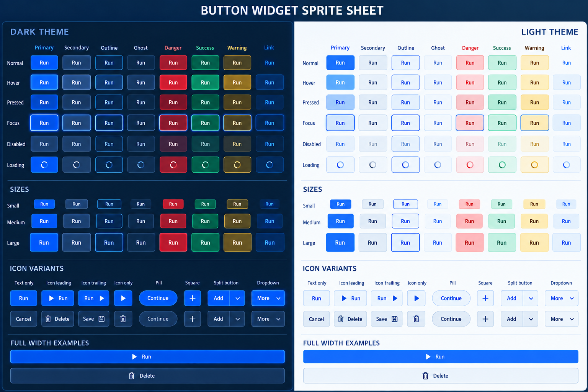

# Kryon Theme and Button Specification

Status: implemented button/theme foundation; broader widget migration is ongoing
Scope: public theme model, shared widget styling, and the canonical `Button` widget
Rule: no new public name in this specification uses the `UI` prefix



## 1. Decision

Kryon exposes one declarative `ThemeFamily` value containing the application's
light and dark themes. An application installs the family once with
`SetThemeFamily()`. Every widget reads the selected theme automatically, and a
mode change switches the whole application without reconstructing widget props.

`Button` remains the single public button widget. Visual intent is expressed by
semantic props and optional values. Named visual style APIs such as
`ButtonStylePrimary`, `ButtonStyleSecondary`, `ButtonStyleDanger`,
`ButtonStyleTab`, and `ButtonStyleTabSelected` shall be removed after maintained
callers are migrated.

The ordinary call stays small:

```c
if(Button((ButtonProps){
    .bounds = save_bounds,
    .label = "Save",
})) {
    SaveDocument();
}
```

The application theme is installed once:

```c
ThemeFamily themes = {
    .name = "Product",
    .light = ThemeDefaultLight(),
    .dark = ThemeDefaultDark(),
};
themes.light.colors.accent = ColorHex(0x2563EBFF);
themes.dark.colors.accent = ColorHex(0x3B82F6FF);
SetThemeFamily(themes);
```

That one call styles buttons, inputs, selections, menus, dialogs, navigation,
tables, tooltips, scrollbars, and future widgets.

## 2. Goals

1. One theme value configures the whole application.
2. One widget concept has one public widget function.
3. Defaults produce a complete, accessible interface with zero style props.
4. Props describe content, behavior, semantic intent, layout, and rare local
   overrides. They do not select branded visual recipes.
5. Light, dark, high-contrast, and custom themes use the same schema.
6. C, Go, generated C, generated C++, generated Go, web, and software rendering
   resolve identical visual values.
7. Theme switching is immediate and does not rebuild application state.
8. Focus, hover, press, disabled, selected, and loading are resolved centrally.

## 3. Non-goals

- Kryon shall not ship parallel `PrimaryButton`, `DangerButton`, `SmallButton`,
  or `TabButton` entry points.
- Kryon shall not make applications fill every state color.
- Kryon shall not infer product meaning from label text.
- Kryon shall not expose renderer-specific styling in widget props.
- This proposal does not add Kapsule-specific terminal or product behavior.

## 4. Naming rules

All new public names use direct domain names:

| Use | Do not use |
|---|---|
| `Theme` | `UITheme` |
| `ThemeColors` | `UIColorTokens` |
| `ThemeMetrics` | `UIStyleTokens` |
| `ButtonProps` | `UIButtonProps` |
| `ButtonTone` | `UIButtonStyle` |
| `SetTheme` | `SetUITheme` |
| `GetTheme` | `GetUITheme` |
| `ResolveButtonStyle` | `UIResolveButtonStyle` |

Existing `UI*` names are migration inputs, not names to preserve or expand.

## 5. Public theme model

The public schema is intentionally finite and strongly typed. Zero-initialized
optional values inherit from their semantic parent.

```c
typedef enum ThemeMode {
    ThemeModeLight,
    ThemeModeDark,
    ThemeModeHighContrast
} ThemeMode;

typedef struct ThemeColors {
    Color background;
    Color surface;
    Color surface_raised;
    Color surface_sunken;
    Color overlay;

    Color text;
    Color text_muted;
    Color text_disabled;
    Color icon;
    Color icon_muted;

    Color border;
    Color border_strong;
    Color divider;
    Color focus;
    Color selection;

    Color accent;
    Color on_accent;
    Color accent_hover;
    Color accent_pressed;

    Color success;
    Color on_success;
    Color warning;
    Color on_warning;
    Color danger;
    Color on_danger;
    Color info;
    Color on_info;

    Color link;
    Color link_hover;
    Color shadow;
} ThemeColors;

typedef struct ThemeMetrics {
    float radius_small;
    float radius_medium;
    float radius_large;
    float radius_pill;

    float border_width;
    float focus_width;
    float focus_gap;

    float space_1;
    float space_2;
    float space_3;
    float space_4;
    float space_5;
    float space_6;

    float control_height_small;
    float control_height_medium;
    float control_height_large;
    float control_padding_small;
    float control_padding_medium;
    float control_padding_large;
    float control_gap;

    float font_size_small;
    float font_size_medium;
    float font_size_large;
    float icon_size_small;
    float icon_size_medium;
    float icon_size_large;

    float shadow_offset_y;
    float shadow_blur;
    float disabled_opacity;
    float transition_fast_ms;
    float transition_normal_ms;
} ThemeMetrics;

typedef struct Theme {
    const char *name;
    ThemeMode mode;
    ThemeColors colors;
    ThemeMetrics metrics;
} Theme;
```

Public operations:

```c
Theme ThemeDefaultLight(void);
Theme ThemeDefaultDark(void);

void SetTheme(Theme theme);
void SetThemeFamily(ThemeFamily family);
ThemeFamily GetThemeFamily(void);
Theme GetTheme(void);
const Theme *GetThemeRef(void);
```

`SetTheme()` copies the value into runtime-owned storage. A caller may release
its original value after the call. `GetThemeRef()` is read-only and valid until
the next theme mutation.

## 5.1 Runtime source of truth

Each public button widget has one canonical Kry source module:

- `runtime/button.kry` owns tone, emphasis, state, and color policy.
- `runtime/button.kry` owns Button menu-mode state transitions.
- `runtime/button.kry` owns Button split-mode geometry.
- `runtime/theme.kry` owns light, dark, and system mode resolution.

The build runs every module through strict `k2c` and `k2go`; native C and Go
renderers call the generated functions. Input collection, focus routing, popup
storage, font measurement, and drawing remain thin platform adapters. New
widget policy belongs in its widget's `.kry` file, not duplicated in a backend.

## 6. Required default values

All dimensions are logical pixels and pass through Kryon's scale system at
render time.

### Metrics

| Variable | Default |
|---|---:|
| `radius_small` | 4 |
| `radius_medium` | 8 |
| `radius_large` | 12 |
| `radius_pill` | 999 |
| `border_width` | 1 |
| `focus_width` | 2 |
| `focus_gap` | 2 |
| `space_1` … `space_6` | 4, 8, 12, 16, 24, 32 |
| small / medium / large control height | 32, 40, 48 |
| small / medium / large horizontal padding | 12, 16, 20 |
| `control_gap` | 8 |
| small / medium / large font size | 13, 14, 16 |
| small / medium / large icon size | 14, 16, 20 |
| `shadow_offset_y` | 2 |
| `shadow_blur` | 8 |
| `disabled_opacity` | 0.45 |
| fast / normal transition | 80 ms / 140 ms |

### Default dark colors

| Variable | RGBA hex |
|---|---|
| `background` | `#071426FF` |
| `surface` | `#0D2138FF` |
| `surface_raised` | `#122B48FF` |
| `surface_sunken` | `#081A2EFF` |
| `overlay` | `#020817D9` |
| `text` | `#F5F8FFFF` |
| `text_muted` | `#A9BBD1FF` |
| `text_disabled` | `#72839AFF` |
| `icon` | `#D8E5F5FF` |
| `icon_muted` | `#8EA3BCFF` |
| `border` | `#31506FFF` |
| `border_strong` | `#53789FFF` |
| `divider` | `#233F5DFF` |
| `focus` | `#4DA3FFFF` |
| `selection` | `#1E6DE0FF` |
| `accent` | `#1478FFFF` |
| `on_accent` | `#FFFFFFFF` |
| `accent_hover` | `#2D8CFFFF` |
| `accent_pressed` | `#0862D9FF` |
| `success` / `on_success` | `#079669FF` / `#FFFFFFFF` |
| `warning` / `on_warning` | `#C88700FF` / `#161000FF` |
| `danger` / `on_danger` | `#DC2F4FFF` / `#FFFFFFFF` |
| `info` / `on_info` | `#168BD2FF` / `#FFFFFFFF` |
| `link` / `link_hover` | `#59A8FFFF` / `#8AC2FFFF` |
| `shadow` | `#00081580` |

### Default light colors

| Variable | RGBA hex |
|---|---|
| `background` | `#F5F8FCFF` |
| `surface` | `#FFFFFFFF` |
| `surface_raised` | `#FFFFFFFF` |
| `surface_sunken` | `#EAF1F8FF` |
| `overlay` | `#10233A66` |
| `text` | `#10233AFF` |
| `text_muted` | `#536A83FF` |
| `text_disabled` | `#8C9AA9FF` |
| `icon` | `#183C63FF` |
| `icon_muted` | `#6E8298FF` |
| `border` | `#C5D4E3FF` |
| `border_strong` | `#8EA8C2FF` |
| `divider` | `#D9E3EDFF` |
| `focus` | `#066CFFFF` |
| `selection` | `#D8E9FFFF` |
| `accent` | `#1769E8FF` |
| `on_accent` | `#FFFFFFFF` |
| `accent_hover` | `#0F5ED8FF` |
| `accent_pressed` | `#0A4DB8FF` |
| `success` / `on_success` | `#07805AFF` / `#FFFFFFFF` |
| `warning` / `on_warning` | `#B56D00FF` / `#FFFFFFFF` |
| `danger` / `on_danger` | `#D62445FF` / `#FFFFFFFF` |
| `info` / `on_info` | `#087CBFFF` / `#FFFFFFFF` |
| `link` / `link_hover` | `#075FD1FF` / `#034BA9FF` |
| `shadow` | `#17324D24` |

## 7. Color completion and validation

Apps may start with a complete default and change only brand values. Kryon shall
provide no partially valid active theme.

```c
Theme theme = ThemeDefaultDark();
theme.name = "Product dark";
theme.colors.accent = product_blue;
theme.colors.focus = product_blue_light;
SetTheme(theme);
```

Before activation, Kryon validates:

- every required color has non-zero alpha;
- finite metrics are non-negative;
- `radius_pill` is not smaller than `radius_large`;
- control heights can contain their font and vertical padding;
- `disabled_opacity` is clamped to `[0, 1]`;
- text/background and semantic foreground/background contrast are checked;
- missing derived accent states are computed only by builder helpers, never by
  guessing inside individual widgets.

Recommended contrast: at least 4.5:1 for ordinary text, 3:1 for large text,
icons, borders that communicate state, and focus indicators.

## 8. Canonical button API

```c
typedef enum ButtonTone {
    ButtonToneAccent,
    ButtonToneNeutral,
    ButtonToneDanger,
    ButtonToneSuccess,
    ButtonToneWarning
} ButtonTone;

typedef enum ButtonEmphasis {
    ButtonEmphasisFilled,
    ButtonEmphasisSoft,
    ButtonEmphasisOutline,
    ButtonEmphasisGhost,
    ButtonEmphasisLink
} ButtonEmphasis;

typedef enum ControlSize {
    ControlSizeSmall,
    ControlSizeMedium,
    ControlSizeLarge
} ControlSize;

typedef enum IconPlacement {
    IconPlacementLeading,
    IconPlacementTrailing
} IconPlacement;

typedef struct Style {
    unsigned int fields;
    Color background;
    Color foreground;
    Color border;
    Color focus;
    float radius;
    float border_width;
    float opacity;
    float padding_x;
    float padding_y;
    float gap;
    float font_size;
    float icon_size;
    Vector2 content_offset;
} Style;

typedef struct ControlStyle {
    Style normal;
    Style hover;
    Style pressed;
    Style focused;
    Style disabled;
    Style loading;
    Style selected;
} ControlStyle;

typedef struct ButtonProps {
    Rectangle bounds;
    const char *label;
    int id;

    ButtonTone tone;
    ButtonEmphasis emphasis;
    ControlSize size;

    Texture2D icon;
    IconPlacement icon_placement;
    int icon_only;
    int full_width;
    int pill;
    int circle;

    int disabled;
    int loading;
    int selected;

    ControlStyle style;
} ButtonProps;

int Button(ButtonProps props);
```

Zero-value behavior is deliberately useful:

- `tone = ButtonToneAccent`
- `emphasis = ButtonEmphasisFilled`
- `size = ControlSizeMedium`
- leading icon placement
- not disabled, loading, selected, pill, circle, icon-only, or full-width
- an empty `style`, therefore inherit the theme completely

`tone` is semantic color intent. `emphasis` is visual hierarchy. Their product
replaces a growing list of named button styles. For example, a destructive
secondary action is `.tone = ButtonToneDanger` plus
`.emphasis = ButtonEmphasisOutline`; it does not require another enum member.

`style` is the typed local customization surface shared by interactive nodes.
Its explicit field mask makes transparent colors and numeric zero valid
overrides. `normal` layers over the semantic theme recipe, then the active
state layers over `normal`. Styling never changes interaction or accessibility.
Product-wide styling should still use `SetTheme()`.

Tabs, segmented items, menu entries, and toolbar actions may reuse the internal
button interaction primitive, but their public APIs remain their real domain
concepts. They shall not pretend to be `ButtonStyleTab`.

## 9. Button state model

Exactly one state is selected by this precedence:

1. disabled
2. loading
3. pressed
4. hover
5. focused
6. selected
7. normal

Focus is also painted as an outer ring and therefore may coexist visually with
normal, hover, pressed, or selected. Disabled controls never hover, focus, or
activate. Loading controls keep their width, replace the leading content with a
spinner, preserve the accessible label, and do not activate again.

Keyboard contract:

- `Tab` and `Shift+Tab` traverse enabled buttons;
- `Enter` and `Space` activate the focused button;
- focus is visible for keyboard navigation;
- pointer activation may focus the button but must not hide a focus ring that
  the platform accessibility mode requires;
- activation occurs once per complete input action.

Pointer contract:

- hover begins only inside the final clipped bounds;
- press capture remains with the initiating button;
- release activates only according to the shared Kryon activation policy;
- disabled and loading buttons do not capture activation.

## 10. Button style resolution

`ResolveButtonStyle(theme, props, state)` is the only resolver used by C, Go,
web, software, and composed widgets.

| Emphasis | Background | Foreground | Border |
|---|---|---|---|
| Filled | tone base | tone foreground | transparent or tone base |
| Soft | tone base mixed 14% into surface | tone base/readable | transparent |
| Outline | transparent | tone base | tone base |
| Ghost | transparent | tone base | transparent |
| Link | transparent | link color | transparent |

Tone bases are `accent`, `text`, `danger`, `success`, and `warning`.
`ButtonToneNeutral + Filled` uses `surface_raised` with `text`, rather than a
solid text-colored fill.

State transforms:

- hover uses the explicit accent hover value for accent-filled buttons;
  otherwise it mixes 8% foreground into background;
- pressed uses the explicit accent pressed value for accent-filled buttons;
  otherwise it mixes 14% foreground into background and offsets content by at
  most one logical pixel;
- selected mixes 12% tone into the normal background and strengthens border;
- disabled applies `disabled_opacity` after normal resolution and uses
  `text_disabled` where contrast remains valid;
- focus draws `focus_width` outside the control with `focus_gap`; it never
  changes layout bounds;
- loading retains the normal/disabled paint and draws a spinner using the
  resolved foreground.

All mixing occurs in linear sRGB and converts back to sRGB for storage. Alpha
is composed after color mixing. Renderers must not invent different values.

## 11. Geometry and content

The theme controls default height, padding, radius, font, icon size, content
gap, border, focus ring, and animation duration. Explicit positive `bounds`
dimensions win. A zero width uses measured content width unless `full_width` is
set, in which case it consumes the available layout width. A zero height uses
the selected size token.

Content order is icon, gap, label for leading placement and label, gap, icon for
trailing placement. Icon-only buttons require a non-empty accessible label even
when the visual label is hidden. Pill buttons use `radius_pill`. Square
icon-only buttons use the resolved control height as width. Circle buttons
always resolve to equal width and height and use an exact 50% radius.

Text truncates with an ellipsis only when the caller supplies a constrained
width. The label never silently scales below the theme's small font size.

## 12. Whole-application inheritance

Every widget resolves from the same `Theme`:

| Widget concern | Theme source |
|---|---|
| windows and pages | `background` |
| cards, menus, dialogs | `surface`, `surface_raised`, shadow metrics |
| inputs | `surface_sunken`, `border`, `focus`, text colors |
| buttons and selections | semantic colors + control metrics |
| errors and destructive actions | `danger`, `on_danger` |
| links | `link`, `link_hover` |
| disabled content | `text_disabled`, `disabled_opacity` |
| spacing and sizing | shared `ThemeMetrics` scale |

Widgets may expose semantic props such as `danger`, `selected`, `read_only`, or
`size`. They shall not contain a second independent theme system.

## 13. Light and dark configured once

The normal application contract is one family declaration:

```c
ThemeFamily themes = {
    .name = "Product",
    .light = ThemeDefaultLight(),
    .dark = ThemeDefaultDark(),
};

SetThemeFamily(themes);
SetThemeMode(preference.dark ? THEME_MODE_DARK : THEME_MODE_LIGHT);
```

System-following behavior changes only the active mode. The installed family
remains the source of both palettes, so widgets never need per-theme props.

Kryon may keep a catalog of complete themes as convenience data. Theme identity
is not a rendering branch. The renderer sees only the active `Theme` value.

## 14. Declarative language shape

The same model shall be expressible in `.kry` without positional style values:

```kry
theme ProductDark {
    base = DefaultDark
    colors {
        accent = "#2563EB"
        accent_hover = "#3B82F6"
        accent_pressed = "#1D4ED8"
        focus = "#60A5FA"
    }
    metrics {
        radius_medium = 8
        control_height_medium = 40
    }
}

app "Example" {
    theme = ProductDark

    Button {
        label = "Save"
    }

    Button {
        label = "Delete"
        tone = Danger
        emphasis = Outline
    }
}
```

Generated output shall create one `Theme`, call `SetTheme()` during app setup,
and emit ordinary `ButtonProps`. It shall not emit legacy `ThemeStyle` or
`ButtonStyle` values.

## 15. Kryon replacement map

This is the implementation map to execute only after this specification is
approved.

| Current surface | Required replacement |
|---|---|
| `include/theme_style.h` `ThemeStyle` | remove; geometry belongs to `ThemeMetrics` |
| `include/ui_controls.h` `ThemeMetrics` | replace with `ThemeMetrics` in `theme.h` |
| `include/ui_controls.h` `ThemeScheme` | replace with private resolution from `ThemeColors` |
| `include/ui_controls.h` `ButtonStyle` | replace with `ButtonTone` + `ButtonEmphasis` |
| `include/ui_tree.h` `ButtonProps.style` | replace with `tone`, `emphasis`, `size`, state/content props |
| `src/core/theme.c` catalog getters | produce/activate complete `Theme` values |
| `src/ui/ui_style.c` style branches | replace with theme validation and shared resolvers |
| `src/ui/button.c` `ui_button_style_colors` | replace with `ResolveButtonStyle` |
| `src/ui/button.c` `RenderStyledButton` | remove after callers use canonical `Button`/private primitive |
| `src/ui/modal.c`, `rows.c`, `pager.c`, navigation | migrate from named styles to semantic props |
| `go/kryon/runtime.go` theme/button enums | mirror the exact C schema and resolver behavior |
| `cmd/k2c`, `cmd/k2cpp`, `cmd/k2go`, `cmd/k2b` | emit the new props and one app theme |
| `web/kryon-runtime.*` | expose the same theme and button contract |
| `themes/*.ini` | migrate to complete versioned theme documents or generated `Theme` values |
| API docs/examples/tests | remove legacy names after maintained callers migrate |

Temporary adapters may translate old values during one controlled migration,
but generated output and new code must never use them. Remove adapters when all
maintained apps and fixtures are migrated.

## 16. Required implementation order

1. Add `Theme`, defaults, validation, and shared paint resolution in C with no
   public `UI` prefix.
2. Add matching Go types and golden parity tests for every resolved field.
3. Convert canonical `Button` in C and Go.
4. Convert composed widgets to semantic props.
5. Update `.kry` lowering and all generated runtimes.
6. Migrate Kryon examples and maintained downstream applications.
7. Remove named button styles, `ThemeStyle`, `ThemeMetrics`, duplicate helpers,
   and compatibility output.
8. Update the public API snapshot and conformance documentation.

All changes are made in the root Kryon repository on `master`; downstream
`vendor/kryon` trees remain pristine and receive only a committed submodule
pointer update.

## 17. Verification matrix

Tests shall cover every combination of:

- light, dark, and high-contrast themes;
- accent, neutral, danger, success, and warning tones;
- filled, soft, outline, ghost, and link emphasis;
- normal, hover, pressed, focus, disabled, loading, and selected states;
- small, medium, and large sizes;
- text-only, leading icon, trailing icon, icon-only, pill, square, and
  full-width content;
- mouse, keyboard, touch, clipping, scaling, and disabled scopes;
- C, Go, generated C, generated C++, generated Go, web, and software backends.

Golden tests compare resolved values, not screenshots alone. Screenshot tests
verify layout, clipping, focus rings, and theme switching at 1x, 1.5x, and 2x.

## 18. Acceptance criteria

This proposal is implemented only when all are true:

- an app can fully rebrand every widget by modifying one `Theme` value;
- a default button requires only bounds and label;
- no new public theme or widget API uses the `UI` prefix;
- no public named button style enum remains;
- no renderer contains its own button color decisions;
- theme switching updates all widgets in the same frame;
- C and Go resolve byte-identical colors and equivalent scaled metrics;
- focus and disabled behavior remain accessible;
- maintained apps build with clean `vendor/*` submodules;
- public docs contain one canonical theme path and one canonical button path.

## 19. Review decisions

Before implementation, approve or amend these deliberate choices:

1. `ButtonTone` and `ButtonEmphasis` are orthogonal semantic props, not named
   styles.
2. `ControlSize` is shared across all controls.
3. the default button is neutral + filled + medium; accent is always explicit.
4. app themes are complete copied values installed once with `SetTheme()`.
5. system theme following resolves outside widget drawing.
6. local `Style` is allowed only as an explicit escape hatch.
7. the default palettes and metrics in sections 6 and 10 are the baseline.
