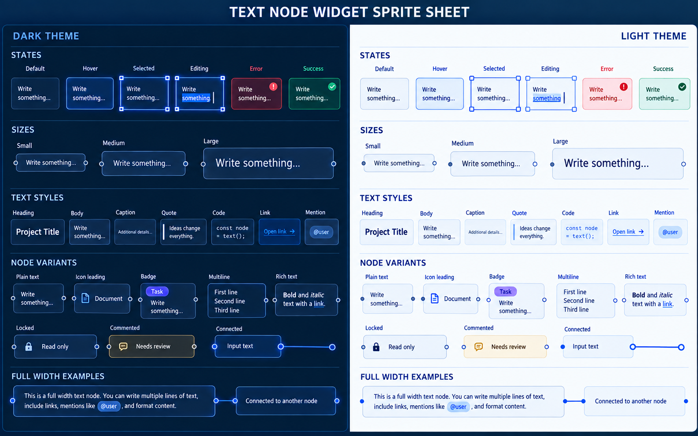

# Kryon Theme and Text Specification

Status: proposal for review\
Scope: canonical read-only text, typography tokens, text measurement, selection, and shared text behavior in controls\
Companion: [Theme and Button Specification](THEME_AND_BUTTON_SPEC.md)\
Rule: no legacy text API, public `UI` prefix, renderer-specific style, or per-call theme reconstruction remains in the target state



## 1. Decision

Kryon's primary public authoring surface shall be `.kry`, with exactly one
read-only text node named `Text`, directly parallel to `Button`:

```kry
Text message: {
    bounds = message_bounds
    text = "Saved"
}
```

There is no `UIText`, `UITextNode`, `WidgetText`, or other prefixed synonym.
The corresponding generated runtime surface also has exactly one function:

```c
void Text(TextProps props);
```

The generated C call stays small:

```c
Text((TextProps){
    .bounds = message_bounds,
    .text = "Saved",
});
```

`.kry` is authoritative for the public shape. k2c, k2cpp, k2go, and k2b lower
that shape directly; generated-language structs are faithful targets, not
separate APIs that can add names or semantics.

`Text` reads typography, foreground, selection, disabled treatment, spacing,
and scale from the active `Theme`. A caller selects semantic meaning with
`role` and `tone`; it does not restate font size, font face, weight, line
height, or theme colors.

```c
Text((TextProps){
    .bounds = title_bounds,
    .text = "Project settings",
    .role = TextRoleTitle,
});

Text((TextProps){
    .bounds = error_bounds,
    .text = "A project name is required.",
    .role = TextRoleCaption,
    .tone = TextToneDanger,
});
```

`Button` composes `Text` directly. Its `label` property is only concise `.kry`
syntax for an ordinary child Text node:

```kry
Button save_short: { label = "Save" }

Button save_composed: {
    Text { text = "Save" }
}
```

Both forms must lower to the same resolved content tree and render identically.
Button owns interaction and chrome; Text owns label measurement and painting.
There is no independent Button label renderer.

`TextField` and `TextArea` remain distinct public widgets because they own
editable buffers, cursor movement, composition, focus, scrolling, validation,
and commit behavior. They shall use the same `Theme`, `ControlSize`, typography,
selection, and focus tokens as `Text` and `Button`. They shall not maintain a
parallel `TextInputStyle` theme.

The end state contains no positional `Text(...)` overload, public `RenderText*`,
`UIText*`, `TextStyle`, `TextInputStyle`, `ParagraphText`, `LabelText`,
`BulletText`, `TextLines`, or generated compatibility shim. Maintained callers
are migrated to canonical props and the old surface is deleted.

## 2. Goals

1. One active `Theme` owns all typography and text colors.
2. One read-only text concept has one public widget function.
3. Body text requires only bounds and content.
4. Props express semantics, layout, selection, and state—not branded styling.
5. `Text`, `Button`, `TextField`, and `TextArea` share one type scale and state
   vocabulary.
6. C, Go, generated C, generated C++, generated Go, web, software, and native
   widget backends produce equivalent layout.
7. Unicode measurement, wrapping, clipping, ellipsis, selection, and DPI
   scaling are centralized.
8. Theme switching updates all visible text in the same frame.
9. `.kry` declarations for `Text` and `Button` use the same concise props model
   and are the source of truth for generated output.

## 3. Non-goals

- `Text` is not an editable rich-text document model.
- Kryon shall not ship `Heading`, `Caption`, `MutedText`, `ErrorText`,
  `WrappedText`, or `SelectableText` widget entry points.
- Kryon shall not infer a role from content, position, or font size.
- This proposal does not add Kapsule terminal rendering to Kryon text widgets.
- Applications still own copy, localization keys, document structure, and
  product-specific validation rules.
- Arbitrary per-span markup is deferred; inline links or mentions use their
  actual domain widgets or a future explicit span model.

## 4. Naming and ownership

| Use | Remove or keep private |
|---|---|
| `Text` | positional `Text`, `RenderText*`, `UIText*` |
| `TextProps` | parallel text node structs |
| `TextRole` | raw public size/style recipes |
| `TextTone` | direct theme-color getters in app text calls |
| `MeasureText` | `TextWidth`, `TextHeight`, renderer-specific measurement |
| `TextMetrics` | unrelated width/height/baseline helpers |
| `TextField`, `TextArea` | `TextInputControl`, `ui_text_field_render`, `ui_text_area_render` |

Internal rasterization, glyph fallback, platform composition, and painting
helpers may keep focused private names. They are not public widget APIs.

The no-prefix rule is absolute for the target public surface. It applies to
`.kry`, C, C++, Go, generated declarations, documentation, examples, and
inspection metadata. `UI` may appear only in private implementation symbols
that cannot be observed or called by applications, and those should be renamed
when touched rather than expanded.

## 5. Theme typography model

The companion theme specification adds typography as a first-class part of the
same `Theme` value:

```c
typedef int FontId;

typedef enum TextRole {
    TextRoleInherit,
    TextRoleBody,
    TextRoleTitle,
    TextRoleHeading,
    TextRoleLabel,
    TextRoleCaption,
    TextRoleCode
} TextRole;

typedef struct TextToken {
    FontId font;
    float size;
    float line_height;
    int weight;
    int italic;
    float letter_spacing;
} TextToken;

typedef struct ThemeTypography {
    TextToken body;
    TextToken title;
    TextToken heading;
    TextToken label;
    TextToken caption;
    TextToken code;
} ThemeTypography;

typedef struct Theme {
    const char *name;
    ThemeMode mode;
    ThemeColors colors;
    ThemeMetrics metrics;
    ThemeTypography typography;
} Theme;
```

`FontId` is an opaque Kryon font registration handle, not a backend texture or
native toolkit object. Zero selects the registered default UI font. A missing
heading or code font inherits the body font while keeping that role's remaining
metrics. Theme activation validates and completes all tokens once; widgets do
not guess typography while drawing.

Recommended default logical values:

| Role | Size | Line height | Weight | Family intent |
|---|---:|---:|---:|---|
| Body | 14 | 20 | 400 | UI sans |
| Title | 28 | 34 | 700 | UI sans |
| Heading | 20 | 26 | 650 | UI sans |
| Label | 14 | 18 | 600 | UI sans |
| Caption | 12 | 16 | 400 | UI sans |
| Code | 13 | 19 | 400 | monospace |

Weight is an intent resolved to the nearest registered face. It must not
synthesize renderer-specific bolding. All values scale through Kryon's single
logical-pixel scale path.

## 6. Canonical Text API

```c
typedef enum TextTone {
    TextToneInherit,
    TextToneDefault,
    TextToneMuted,
    TextToneAccent,
    TextToneSuccess,
    TextToneWarning,
    TextToneDanger,
    TextToneLink
} TextTone;

typedef enum TextWrap {
    TextWrapAuto,
    TextWrapNone
} TextWrap;

typedef enum TextOverflow {
    TextOverflowClip,
    TextOverflowEllipsis
} TextOverflow;

typedef enum TextAlign {
    TextAlignStart,
    TextAlignCenter,
    TextAlignEnd
} TextAlign;

typedef struct TextProps {
    Rectangle bounds;
    const char *text;
    int id;

    TextRole role;
    TextTone tone;
    TextWrap wrap;
    TextOverflow overflow;
    TextAlign align;
    TextAlign vertical_align;

    int max_lines;
    int selectable;
    int disabled;
} TextProps;

void Text(TextProps props);
```

Zero-value behavior is deliberately useful and composable:

- `role = TextRoleInherit`, falling back to Body at the content root;
- `tone = TextToneInherit`, falling back to default text at the content root;
- positive width wraps automatically;
- zero width measures intrinsically and therefore behaves as one line;
- overflow clips;
- start alignment on both axes;
- unlimited lines within the supplied height;
- selection off and disabled off;
- `id = 0`, with a stable frame-local ID derived when interaction requires it.

`TextProps` has no `font`, `font_size`, `color`, `weight`, `italic`, or
`line_height`. Those values belong to `ThemeTypography` and `ThemeColors`.
This is intentional: text participates fully in the new theme instead of
carrying a second styling system at every call site.

Button establishes a child content context that resolves inherited Text to the
theme's label typography and the Button's resolved foreground. Consequently,
`label = "Save"` and a bare child `Text { text = "Save" }` are exactly
equivalent. This context also propagates disabled state, available content
bounds, and accessibility ownership.

## 7. Role and tone are orthogonal

`role` answers “what kind of text is this?” `tone` answers “what does it mean
here?” Their product covers the useful variants without named style recipes.

| Intent | Props |
|---|---|
| page title | `TextRoleTitle` + default tone |
| section heading | `TextRoleHeading` + default tone |
| field label | `TextRoleLabel` + default tone |
| supporting metadata | `TextRoleCaption` + muted tone |
| validation failure | body or caption + danger tone |
| inline code | `TextRoleCode` + default tone |
| link label | body or label + link tone |

`TextToneDefault` resolves to `theme.colors.text`; muted resolves to
`text_muted`; semantic tones resolve to their semantic base colors; link uses
`link` and its hover state only when an interactive link widget owns the hit
target. Disabled text resolves through `text_disabled`; widgets do not apply a
second arbitrary fade.

## 8. Geometry, wrapping, and overflow

- `bounds.x` and `bounds.y` locate the text box.
- Zero width uses intrinsic single-line width. Positive width constrains layout.
- Zero height uses measured content height. Positive height clips painting and
  hit testing.
- `TextWrapAuto` wraps on Unicode line-break opportunities and preserves
  explicit newlines.
- `TextWrapNone` never creates a soft line break.
- `max_lines > 0` caps laid-out lines before overflow handling.
- `TextOverflowEllipsis` replaces the final visible grapheme sequence with an
  ellipsis that fits; it never truncates inside a UTF-8 code unit or grapheme.
- Alignment uses logical start/end, so bidirectional text may resolve direction
  without changing the public enum.
- Vertical alignment applies only when bounds height exceeds content height.

Wrapping, measuring, painting, selection, and hit testing consume one shared
layout result. A renderer must not measure with one algorithm and paint with
another.

## 9. Measurement API

Measurement mirrors `TextProps` without drawing:

```c
typedef struct TextMetrics {
    float width;
    float height;
    float baseline;
    int line_count;
    int truncated;
} TextMetrics;

TextMetrics MeasureText(TextProps props);
```

`MeasureText` ignores position and interaction fields but honors bounds width,
bounds height, role, wrapping, overflow, alignment constraints, and max lines.
It resolves the active theme exactly as `Text` does.

Legacy `TextWidth`, `TextHeight`, `TextLineHeight`, `TextBaselineY`,
`ScaledTextWidth`, and centered-draw helpers are removed from the public API.
Internal widgets use the common layout engine or `MeasureText`, never a private
font-size approximation.

## 10. Selection and interaction

Read-only text is not selectable by default. `.selectable = 1` enables pointer
and keyboard selection without turning `Text` into an editor.

- selection is stored by stable widget ID and UTF-8 byte boundaries aligned to
  grapheme clusters;
- dragging may cross wrapped lines and clipped content only within final bounds;
- double click selects a word and triple click selects a visual line;
- `Ctrl/Cmd+C` copies the selection through the platform clipboard API;
- selection paint uses `theme.colors.selection` and readable foreground;
- disabled text cannot begin a selection;
- a selectable node registers accessible static-text semantics and selection;
- pointer capture and clipping follow the same host rules as `Button`.

Selection storage and clipboard helpers remain private implementation details.
There is no global `PushTextSelectable` public mode.

## 11. TextField and TextArea integration

The editable widgets retain their own names and state, but their presentation
is reduced to semantic props:

```c
typedef enum ValidationState {
    ValidationStateNone,
    ValidationStateSuccess,
    ValidationStateWarning,
    ValidationStateError
} ValidationState;

typedef struct TextFieldProps {
    Rectangle bounds;
    char *text;
    int capacity;
    int id;

    const char *placeholder;
    const char *accessible_label;
    ControlSize size;
    ValidationState validation;

    int disabled;
    int read_only;
    int secure;
} TextFieldProps;
```

`TextAreaProps` adds multiline editing concerns such as scrolling, syntax mode,
line numbers, and tab behavior. Both widgets own cursor and selection state by
stable ID; application code owns the buffer. Public props do not expose
renderer paint structs, focus booleans, cursor pointers, or a
`TextInputStyle` bundle.

The active theme supplies:

| Concern | Shared source |
|---|---|
| input text | body typography + `colors.text` |
| placeholder | body typography + `colors.text_muted` |
| label | label typography + `colors.text` |
| validation message | caption typography + semantic tone |
| surface and border | `surface_sunken`, `border` |
| hover and focus | shared control resolver + `focus` |
| selection and caret | `selection`, readable text, `accent` |
| disabled state | `text_disabled`, disabled surface and border |
| height and padding | shared `ControlSize` metrics |

This makes a medium `TextField` and medium `Button` align without duplicated
numeric styling.

## 12. Shared control-state contract

`Button`, `TextField`, and `TextArea` share these rules:

1. disabled state wins over every interactive state;
2. focus is an outer ring and does not alter layout bounds;
3. pointer hit testing uses final clipped bounds;
4. keyboard focus is stable by ID;
5. all state colors come from the active theme resolver;
6. `ControlSizeSmall`, `ControlSizeMedium`, and `ControlSizeLarge` resolve the
   same height, horizontal padding, font role, and icon scale family;
7. transitions use shared theme durations and do not affect deterministic
   layout or input behavior.

Button accepts ordinary non-interactive content nodes. `Row { Icon; Text; }`
is valid; nested interactive controls are rejected. Label shorthand and direct
Text composition use one measurement and paint path on every backend.

Read-only `Text` is not a control and does not draw hover/focus chrome. A link,
mention, comment marker, or connected editor node should use its real public
domain widget and may compose `Text` internally.

## 13. Fonts and fallback

Applications register font sources before installing a theme. A theme stores
only `FontId` values. Kryon owns fallback by codepoint and physical-size cache.

- registration declares immutable glyph coverage;
- missing glyphs search the registered fallback chain;
- layout uses the same resolved face and advance as painting;
- fallback never reallocates an atlas during drawing or typing;
- native backends receive resolved role, size, weight, and line height, not a
  product font name guess;
- web uses the same ordered family registration and waits for required fonts
  before a golden capture;
- missing glyphs are diagnosed in debug builds and render a deterministic
  replacement glyph.

`RegisterUIFontSource*` compatibility names are migrated to concise font
registration names as part of implementation; generated output shall not emit
the stale prefix.

## 14. Canonical `.kry` shape

The `.kry` form is the canonical design. Like `Button`, `Text` accepts one
named property block; it has no alternate positional grammar and no prefixed
node name:

```kry
Text title: {
    bounds = {24, 24, 360, 0}
    text = "Project settings"
    role = Title
}

Text hint: {
    bounds = {24, 68, 360, 0}
    text = "Changes are saved automatically."
    role = Caption
    tone = Muted
}
```

Generated output emits one explicit `TextProps` value. It does not lower role
back into raw font sizes/colors, call `RenderText*`, inject a runtime object, or
select a backend-specific font.

The zero-value pairing is intentionally symmetrical:

```kry
Text status: {
    bounds = {24, 24, 240, 0}
    text = "Ready"
}

Button save: {
    bounds = {24, 60, 120, 0}
    label = "Save"
}
```

Both nodes inherit the active theme. Both use semantic props only when their
meaning differs from the default. Neither accepts a style name, raw theme
recipe, `UI`-prefixed type, or legacy compatibility field.

Theme typography is declared beside the button metrics:

```kry
theme ProductDark {
    base = DefaultDark

    colors {
        accent = "#2563EB"
        focus = "#60A5FA"
    }

    typography {
        body = {font = ProductSans, size = 14, line_height = 20}
        heading = {font = ProductSans, size = 20, line_height = 26, weight = 650}
        code = {font = ProductMono, size = 13, line_height = 19}
    }
}
```

## 15. Renderer contract

All renderers consume a resolved internal text layout containing glyph runs,
line boxes, baseline positions, clipping, selection ranges, and semantic paint.

- C and Go resolve equivalent logical geometry before backend submission.
- Generated C, C++, and Go use the canonical props directly.
- Web maps logical pixels through the same scale and rounding policy.
- Software rendering is the reference for deterministic measurement tests.
- Native toolkit controls may paint editable text natively only when they honor
  the resolved token values and report equivalent geometry.
- Backends do not reinterpret `TextRole`, `TextTone`, or zero values.

## 16. Accessibility and localization

- Text content is exposed as static text unless composed into a more specific
  semantic widget.
- Heading roles map to platform heading semantics where supported.
- Color is never the only validation signal; editable widgets expose validation
  state and associated message text.
- Default theme combinations meet at least 4.5:1 contrast for body text and
  3:1 for large text and required visual state indicators.
- Bounds, wrapping, and control layout must tolerate translated content and
  larger system text scales.
- Truncation is opt-in through explicit constraints; accessible text retains
  the complete content.
- UTF-8 decoding, grapheme movement, word selection, bidirectional ordering,
  and input-method composition are tested independently of locale.

## 17. Replacement map

| Current surface | Required target |
|---|---|
| `TextProps.font` | `TextProps.role` resolved through `ThemeTypography` |
| `TextProps.color` | `TextProps.tone` resolved through `ThemeColors` |
| positional or macro `Text` forms | `Text(TextProps)` only |
| public `RenderText*` and `DrawScaledUIText` | private painter behind `Text` |
| public `TextStyle` | remove; role + tone + theme |
| public `TextInputStyle` | remove; shared control and theme resolution |
| `TextWidth` / `TextHeight` / baseline helpers | `MeasureText(TextProps)` |
| `LabelText`, `BulletText`, `Value*`, `TextLines` | app composition or private composed helpers |
| `ParagraphText` | `Text` with wrapping and bounds |
| `PushTextSelectable` / `PopTextSelectable` | `TextProps.selectable` |
| external cursor/focus pointers in text inputs | state owned by stable widget ID |
| raw theme getters in ordinary text calls | semantic zero defaults or tone |
| C/Go/web-specific text decisions | shared resolved layout and paint contract |
| generated legacy calls | canonical `TextProps`, `TextFieldProps`, `TextAreaProps` |

Compatibility adapters are allowed only inside one controlled migration and
must be deleted before the work is complete. They are never documented as an
alternative and are never used by generated output.

## 18. Implementation order

1. Merge `ThemeTypography` into the same `Theme` model approved for buttons.
2. Add theme completion/validation and the shared text token resolver.
3. Add the common layout result and `MeasureText(TextProps)` in C.
4. Convert canonical C `Text` to role/tone resolution.
5. Mirror types, layout inputs, and resolution in native Go.
6. Convert `Button` into a content container; lower `label` to a child `Text`
   and delete its independent label rendering/measurement path.
7. Convert `TextField` and `TextArea` to shared theme/control resolution and
   stable-ID state ownership.
8. Convert composed widgets to semantic text props and private composition.
9. Make the `.kry` schema authoritative, then update k2c, k2cpp, k2go, k2b,
   web, software, and native backends to mirror it exactly.
10. Migrate every maintained Kryon example, test, and downstream app from the
    root repositories; never edit a downstream `vendor/*` tree.
11. Delete stale helpers, structs, aliases, generated mappings, and scanners'
    allowlists.
12. Regenerate the public API snapshot and update API/architecture docs.

All Kryon work lands directly on the root repository's `master`. Downstream
applications receive a committed submodule pointer only after Kryon is
committed.

## 19. Verification matrix

Tests cover:

- light, dark, high-contrast, and custom typography themes;
- every role and tone, including disabled and validation states;
- intrinsic, wrapped, clipped, ellipsized, aligned, and max-line layouts;
- empty strings, explicit newlines, long unbreakable words, emoji, combining
  marks, CJK, Arabic, RTL/LTR mixtures, and missing glyphs;
- pointer drag, double/triple click, copy, keyboard traversal, selection across
  wrapped lines, and clipped hit testing;
- small, medium, and large Buttons, TextFields, and TextAreas on one baseline;
- theme switching without rebuilding widget or editing state;
- 1x, 1.25x, 1.5x, and 2x scale with deterministic rounding;
- C, native Go, generated C, generated C++, generated Go, web, software, and
  supported native control backends.

Golden tests compare resolved tokens, metrics, line breaks, glyph runs, and
selection rectangles—not screenshots alone. Screenshot tests verify hierarchy,
contrast, clipping, alignment, cursor/focus paint, and theme switching.

Run the clean text API scanner across every changed source root. Its final
denylist includes positional `Text`, public/generated draw-prefixed text helpers, `UIText*`,
`TextInputStyle`, raw `.font`/`.color` text styling, and removed helper widgets.

## 20. Acceptance criteria

The proposal is implemented only when all are true:

- ordinary body text needs only bounds and content;
- `.kry` exposes exactly `Text { ... }`, parallel to `Button { ... }`, with no
  positional alternative;
- one installed `Theme` completely controls Button and text presentation;
- `Text(TextProps)` is the only public read-only text widget;
- `TextProps` contains no raw font or color styling;
- `TextField` and `TextArea` use the same typography, control sizes, focus,
  selection, and semantic colors as `Button`;
- Button label shorthand and a direct child Text have identical resolved trees,
  layout, paint, state propagation, and accessibility;
- no public/generated `UI`-prefixed text API, stale helper, or compatibility
  alias remains;
- measurement and painting use one layout result on every backend;
- theme switching updates text and buttons in the same frame;
- maintained applications and Kryon tests use the canonical API;
- every downstream `vendor/*` submodule is pristine;
- public documentation describes one canonical theme path and one canonical
  API for each text concept.

## 21. Review decisions

Approve or amend these deliberate choices before implementation:

1. `TextRole` and `TextTone` are orthogonal semantic props.
2. `TextProps` has no per-call font, size, weight, line height, or color.
3. zero-value text is body + default tone + automatic wrapping when constrained.
4. `ThemeTypography` is part of the same copied `Theme` value used by Button.
5. `MeasureText(TextProps)` replaces the public collection of size helpers.
6. selection is explicit per text node, not a global push/pop mode.
7. editable widget state is owned by stable ID while applications own buffers.
8. `TextField` and `TextArea` remain separate concepts but have no independent
   public style struct.
9. legacy wrappers are removed after migration rather than preserved as a
   second API.
10. `.kry` is the authoritative public contract; generated runtimes mirror it
    without adding prefixes, fields, or alternate entry points.
