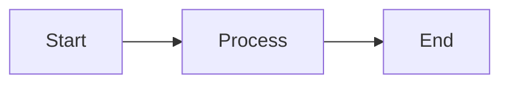

# Kryon Markdown Examples

This directory contains examples demonstrating Kryon's native markdown support.

## Overview

Kryon supports **full CommonMark specification** as a first-class frontend. Markdown files can be compiled and run directly:

```bash
# Run markdown file
kryon run hello_world.md

# Build to web
kryon build documentation.md --targets=web

# Convert to .kir
kryon parse flowchart.md
```

## Supported Features

Kryon's markdown implementation supports:

- ✅ **Headings** (H1-H6) with semantic levels
- ✅ **Paragraphs** with inline formatting
- ✅ **Bold**, *italic*, `code`, [links](#), images
- ✅ **Lists** (ordered, unordered, nested)
- ✅ **Tables** (GFM style with alignment)
- ✅ **Code blocks** with language tags
- ✅ **Blockquotes** (nested)
- ✅ **Horizontal rules**
- ✅ **Mermaid flowcharts** (native IR integration)

## Example Files

- **hello_world.md** - Simple markdown example
- **inline_formatting.md** - Bold, italic, code, links
- **lists.md** - Ordered and unordered lists
- **table_demo.md** - Table with alignment
- **code_blocks.md** - Code blocks with syntax highlighting
- **flowchart.md** - Mermaid diagram integration
- **documentation.md** - Full-featured documentation page

## Mermaid Integration

Mermaid code blocks are automatically converted to native Kryon Flowchart components:

````markdown

````

This renders as an interactive flowchart using Kryon's native rendering engine!

## Embedded Markdown in .kry Files

You can also embed markdown in `.kry` files:

```
Container {
  Markdown {
    source = "# Hello\nThis is **markdown**"
  }
}
```

## Running Examples

```bash
# SDL3 renderer (default)
kryon run hello_world.md

# Terminal renderer
KRYON_RENDERER=terminal kryon run documentation.md

# Web target
kryon build flowchart.md --targets=web
```
