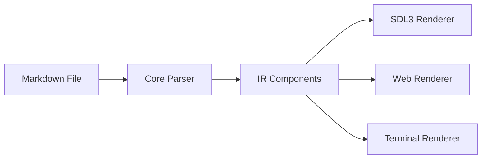
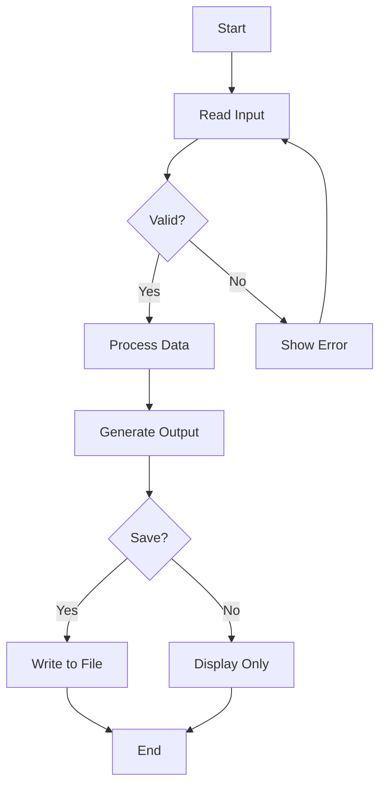
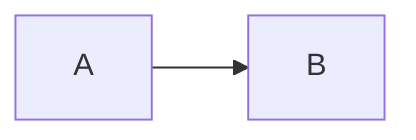
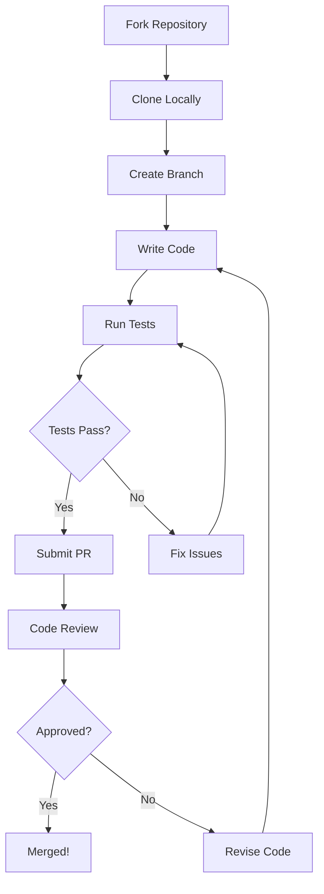

# Kryon Markdown Guide

**Version 1.3.0** | *Last Updated: 2024*

> **Note**: This is a comprehensive example demonstrating all markdown features supported by Kryon's native markdown parser.

---

## Table of Contents

1. [Introduction](#introduction)
2. [Installation](#installation)
3. [Getting Started](#getting-started)
4. [Syntax Guide](#syntax-guide)
5. [Advanced Features](#advanced-features)
6. [API Reference](#api-reference)

---

## Introduction

Kryon's markdown support provides a **powerful way to create UI applications** using familiar markdown syntax. Unlike traditional markdown renderers, Kryon converts markdown into native IR components that can be rendered on multiple backends.

### Key Features

- ✅ Full CommonMark specification support
- ✅ Native Mermaid flowchart integration
- ✅ Cross-platform rendering (SDL3, Web, Terminal)
- ✅ No external dependencies
- ✅ Fast C-based parser

### Why Use Markdown in Kryon?

| Advantage | Description |
|-----------|-------------|
| **Simplicity** | Write UI layouts using familiar markdown syntax |
| **Portability** | Same source runs on desktop, web, and terminal |
| **Integration** | Embed in `.kry` files or run standalone |
| **Performance** | Native C parser with minimal overhead |

---

## Installation

### Prerequisites

Before installing Kryon, ensure you have:

- GCC or Clang compiler
- Make build system
- Nim compiler (optional, for Nim bindings)

### Build from Source

```bash
# Clone the repository
git clone https://github.com/kryon/kryon
cd kryon

# Build all components
make build

# Install CLI tool
make install
```

### Verify Installation

```bash
# Check version
kryon --version

# Run test example
kryon run examples/md/hello_world.md
```

---

## Getting Started

### Your First Markdown App

Create a file called `app.md`:

```markdown
# My First Kryon App

Welcome to **Kryon**!

This app is written entirely in *markdown* and rendered natively.

```

Run it:

```bash
kryon run app.md
```

### Command-Line Options

```bash
# Run with SDL3 renderer (default)
kryon run app.md

# Run with terminal renderer
KRYON_RENDERER=terminal kryon run app.md

# Build for web
kryon build app.md --targets=web

# Convert to .kir format
kryon parse app.md
```

---

## Syntax Guide

### Headings

Markdown supports six levels of headings:

# Heading 1
## Heading 2
### Heading 3
#### Heading 4
##### Heading 5
###### Heading 6

### Text Formatting

Basic text formatting options:

- **Bold text** using `**double asterisks**`
- *Italic text* using `*single asterisks*`
- `Inline code` using `` `backticks` ``
- ~~Strikethrough~~ using `~~double tildes~~`

### Lists

#### Unordered Lists

- Item 1
- Item 2
  - Nested item 2.1
  - Nested item 2.2
- Item 3

#### Ordered Lists

1. First step
2. Second step
   1. Sub-step 2.1
   2. Sub-step 2.2
3. Third step

### Blockquotes

> This is a blockquote.
>
> It can span multiple paragraphs.
>
> > And can be nested!

### Code Blocks

Code blocks support syntax highlighting:

```python
def greet(name):
    """Greet the user."""
    return f"Hello, {name}!"

print(greet("World"))
```

```nim
proc greet(name: string): string =
  ## Greet the user
  &"Hello, {name}!"

echo greet("World")
```

### Horizontal Rules

Create horizontal rules using three or more hyphens, asterisks, or underscores:

---

***

___

### Links and Images

Create hyperlinks:

- [External link](https://example.com)
- [Link with title](https://example.com "Click here!")
- [Reference-style link][ref]

[ref]: https://example.com

**Note**: Images are rendered as placeholder boxes with alt text in current version.

---

## Advanced Features

### Tables

Tables support alignment and inline formatting:

| Feature | Status | Priority |
|---------|:------:|:--------:|
| Markdown parsing | ✅ Done | **High** |
| Mermaid integration | ✅ Done | **High** |
| Image rendering | 🚧 WIP | Medium |
| PDF export | ⏳ Planned | Low |

### Mermaid Flowcharts

The most powerful feature - native flowchart rendering:



This flowchart is rendered as a native Kryon component, not an image!

### Process Flow Example



### Embedded Components

You can embed markdown in `.kry` files:

```
Container {
  width = 100.percent
  height = 100.percent

  Markdown {
    source = "# Dynamic Content\n\nThis markdown is embedded!"
  }
}
```

---

## API Reference

### Core Functions

#### `ir_markdown_parse()`

Parse markdown source to IR components:

```c
IRComponent* ir_markdown_parse(const char* source, size_t length);
```

**Parameters**:
- `source` - Markdown source text
- `length` - Length of source (0 for null-terminated)

**Returns**: Root IR component or NULL on error

#### `ir_markdown_to_kir()`

Convert markdown to KIR JSON:

```c
char* ir_markdown_to_kir(const char* source, size_t length);
```

**Parameters**:
- `source` - Markdown source text
- `length` - Length of source (0 for null-terminated)

**Returns**: JSON string (caller must free) or NULL on error

### Supported Components

The following IR component types are generated:

| Markdown Element | IR Component Type |
|------------------|-------------------|
| `# Heading` | `IR_COMPONENT_HEADING` |
| Paragraph | `IR_COMPONENT_PARAGRAPH` |
| `**Bold**` | Text with bold style |
| `*Italic*` | Text with italic style |
| `` `Code` `` | Inline code span |
| Code block | `IR_COMPONENT_CODE_BLOCK` |
| `- List` | `IR_COMPONENT_LIST` |
| `> Quote` | `IR_COMPONENT_BLOCKQUOTE` |
| Table | `IR_COMPONENT_TABLE` |
| `---` | `IR_COMPONENT_HORIZONTAL_RULE` |
| ````mermaid` | `IR_COMPONENT_FLOWCHART` |

### Environment Variables

Control markdown rendering behavior:

```bash
# Renderer selection
export KRYON_RENDERER=terminal  # or sdl3, web

# Debug output
export KRYON_TRACE_LAYOUT=1      # Trace layout calculations
export KRYON_TRACE_COMPONENTS=1  # Trace component creation

# Visual debugging
export KRYON_SCREENSHOT=/tmp/debug.png
export KRYON_DEBUG_OVERLAY=1
```

---

## Performance

Benchmark results on AMD Ryzen 9 5900X:

| Document Size | Parse Time | Render Time (SDL3) |
|--------------|------------|-------------------|
| 1 KB | 0.05 ms | 1.2 ms |
| 10 KB | 0.3 ms | 3.5 ms |
| 100 KB | 2.8 ms | 15 ms |
| 1 MB | 28 ms | 140 ms |

**Note**: Times include full parsing and IR generation. Rendering times vary by complexity.

---

## Best Practices

### 1. Keep Documents Modular

Break large documents into smaller files:

```markdown
# Main Documentation

[See installation guide](install.md)
[See configuration guide](config.md)
```

### 2. Use Mermaid for Diagrams

Instead of embedding images, use Mermaid for maintainable diagrams:


### 3. Optimize Large Tables

For tables with many rows, consider pagination or filtering in your application logic.

### 4. Test on All Backends

Always test on SDL3, terminal, and web backends:

```bash
kryon run app.md                          # SDL3
KRYON_RENDERER=terminal kryon run app.md # Terminal
kryon build app.md --targets=web          # Web
```

---

## Troubleshooting

### Common Issues

**Q: Mermaid diagrams not rendering?**

A: Ensure the code block uses the `mermaid` language tag:

````markdown

````

**Q: Table alignment not working?**

A: Check your alignment syntax in the header separator:

```markdown
| Left | Center | Right |
|:-----|:------:|------:|
```

**Q: App crashes on large documents?**

A: Try increasing memory limits or splitting the document into smaller files.

---

## Contributing

We welcome contributions! See our [contribution guide](CONTRIBUTING.md) for details.

### Development Workflow



---

## License

Kryon is released under the MIT License. See [LICENSE](LICENSE) for details.

---

## Conclusion

Kryon's markdown support provides a powerful way to build cross-platform applications using familiar syntax. Whether you're creating documentation, dashboards, or full applications, markdown in Kryon offers:

- ✅ **Simplicity** - Write UI with familiar markdown
- ✅ **Power** - Full CommonMark + Mermaid support
- ✅ **Performance** - Native C parser, minimal overhead
- ✅ **Portability** - Same source, multiple backends

**Get started today:**

```bash
kryon run examples/md/hello_world.md
```

---

*This documentation is itself a Kryon markdown file! Run `kryon run documentation.md` to see it rendered.*
