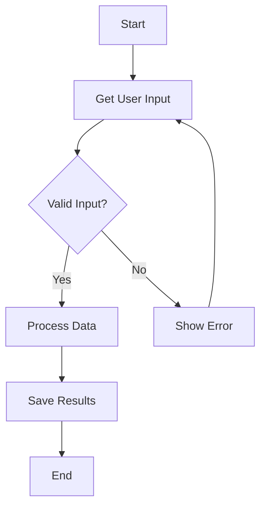
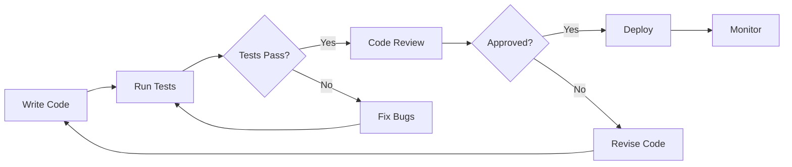
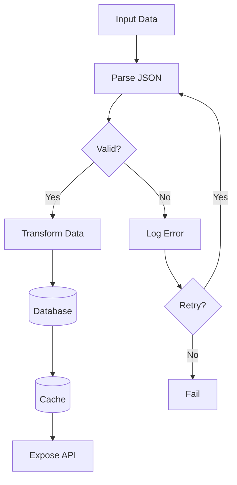
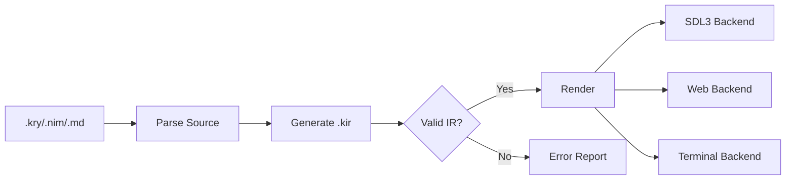
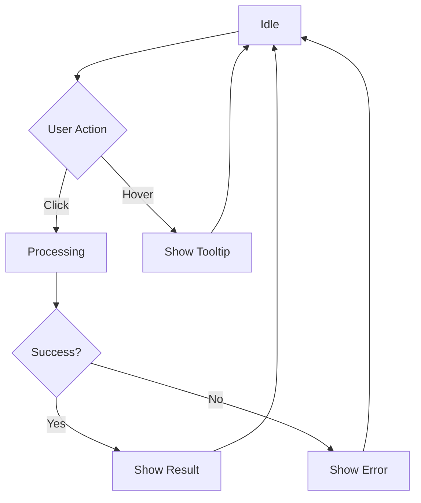
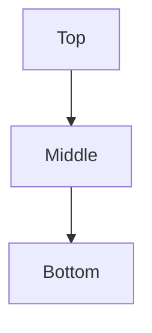
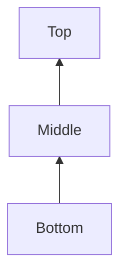

# Mermaid Flowchart Integration

This document demonstrates Kryon's native Mermaid flowchart support.

## What Makes This Special?

Unlike other markdown renderers that convert Mermaid to SVG or images, **Kryon converts Mermaid diagrams directly into native Flowchart IR components**. This means:

- ✅ Flowcharts are rendered using the same engine as `.kry` Flowchart components
- ✅ No external dependencies or JavaScript runtime needed
- ✅ Perfect integration with SDL3, terminal, and web backends
- ✅ Same styling and behavior as native components

## Simple Linear Flow


## Decision Tree



## Development Workflow



## Data Processing Pipeline



## Build System



## State Machine



## Vertical Top-Down



## Vertical Bottom-Up



## Right-to-Left


## How It Works

When Kryon's markdown parser encounters a code block with the `mermaid` language tag:

1. The mermaid source is detected: ````mermaid`
2. It's passed to `ir_flowchart_parse()` (the same parser used for `.kry` Flowchart components)
3. The parser generates native `IR_COMPONENT_FLOWCHART` nodes
4. These are rendered like any other Kryon component

**No external tools needed** - the flowchart parser is built into Kryon!

---

*Run with `kryon run flowchart.md` to see interactive flowcharts rendered natively!*
